# Fun with Linux for Cloud & DevOps Engineers

Hands-on DEVOPS Projects-03

## Skills

Below skills are required to complete the deployment steps:

Linux User Management, Permissions, Directory Structure, File Systems, File Management

## Objectives

1. Login to the server as super user and perform below. (All the below commands were ran in a sandbox environment, good luck with hacking it !!!!)
    1. Create users and set passwords – user1, user2, user3
    - `sudo useradd -m uses1`
    - `sudo useradd -m uses2` 
    - `sudo useradd -m uses3`
      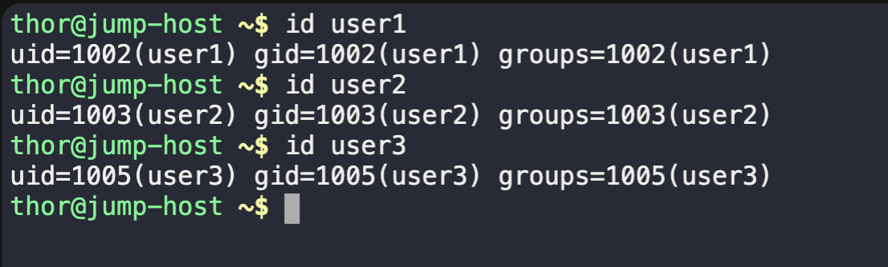
    - `sudo passwd user1`
    - `sudo passwd user2`
    - `sudo passwd user3`
      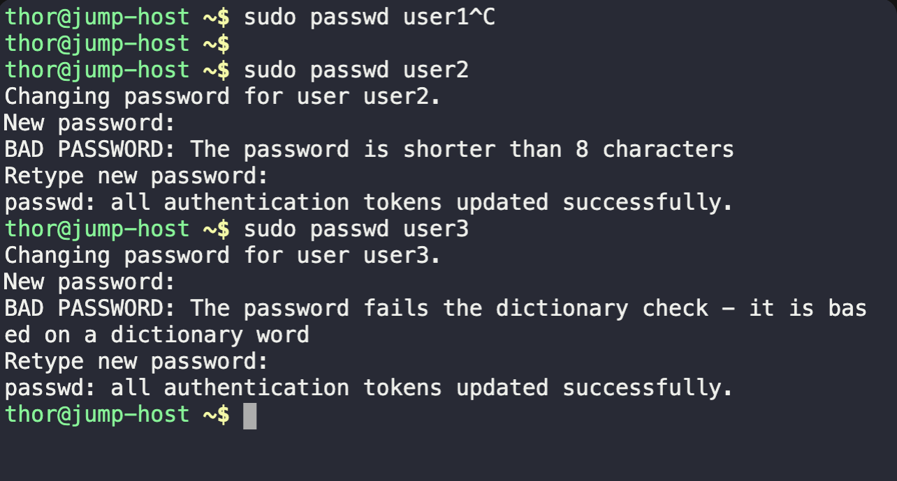
    2. Create Groups – devops, aws
    - `sudo groupadd devops`
    - `sudo groupadd aws`
       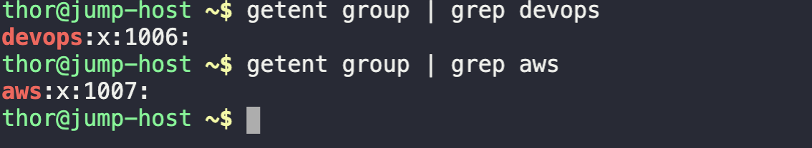
    - `getent group`
    3. Change primary group of user2, user3 to ‘devops’ group
    - `sudo usermod -aG devops user2`
    - `sudo usermod -aG devops user3`
      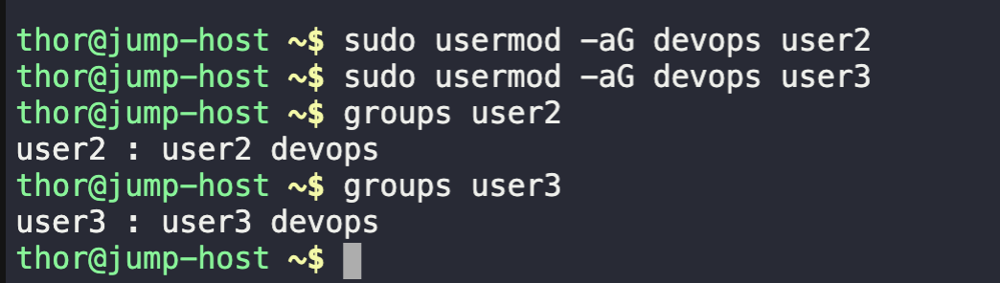
    4. Add ‘aws’ group as secondary group to the ‘user1’
    - `sudo usermod -aG devops user1`
       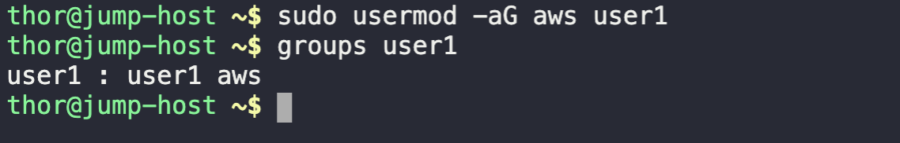
    5. Create the file and directory structure shown in the above diagram.
       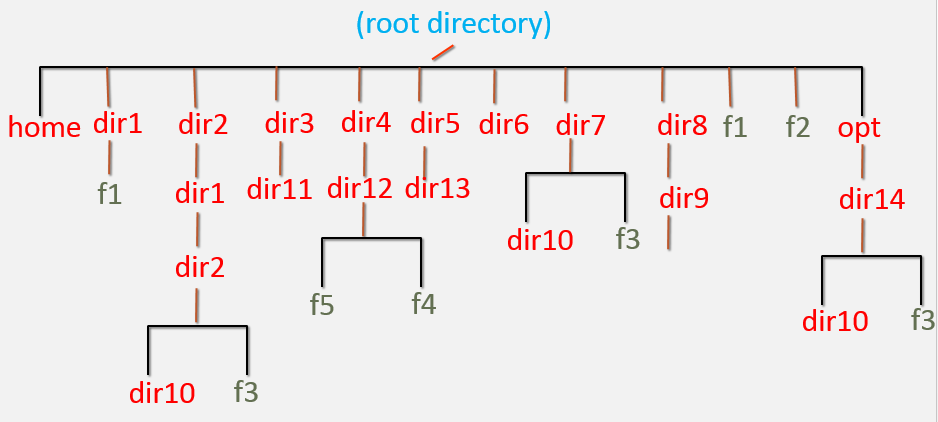
    - `sudo mkdir -p {home,dir1,dir2/dir1/dir2/dir10,dir3/dir11,dir4/dir12,dir5/dir13,dir6,dir7/dir10,dir8/dir9,opt/dir14/dir10}`
    - `sudo touch f1 f2 dir1/f1 dir2/dir1/dir2/f3 dir4/dir12/{f4,f5} dir7/f3 opt/dir14/f3`
       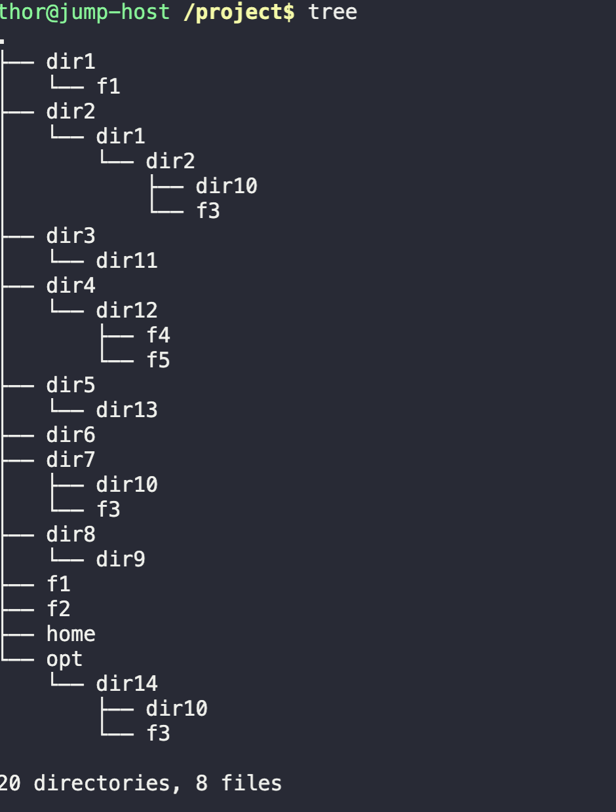
    6. Change group of /dir1, /dir7/dir10, /f2 to “devops” group
    - `sudo chown :devops dir1 dir7/dir10 f2`
       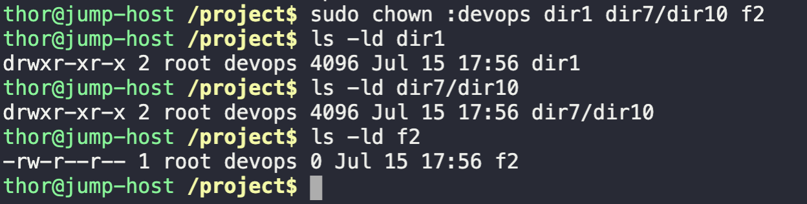
    7. Change ownership of /dir1, /dir7/dir10, /f2 to “user1” user.
    - `sudo chown user1 dir1 dir7/dir10 f2`
       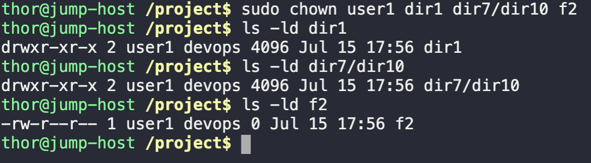
2. Login as user1 and perform below
    1. Create users and set passwords – user4, user5
    - `su - user1`
    - `sudo useradd user4`
     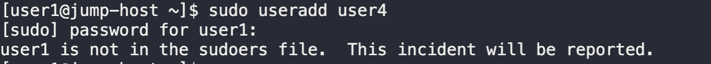
    - `sudo useradd user5`
     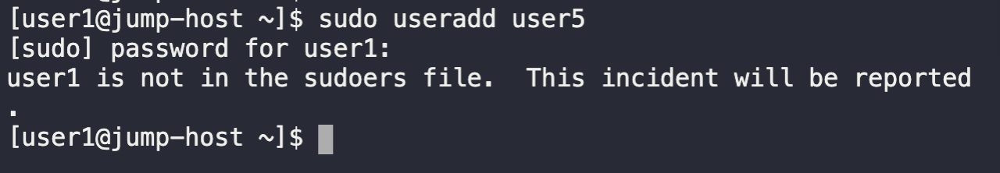

    Change the file in below file to allow user1 to create user

    - `sudo visudo`
    - `sudo useradd user4`
        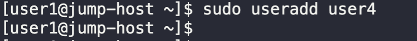
    - `sudo useradd user5`
        

    2. Create Groups – app, database
    - `su - user1`
    - `sudo groupadd app`
    - `sudo groupadd database`
        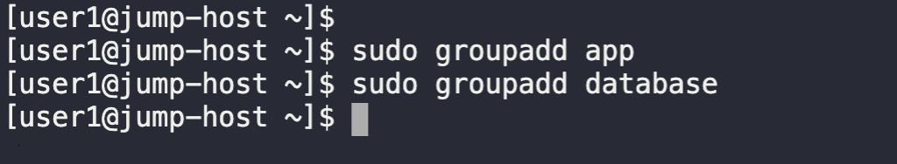

3. Login as ‘user4’ and perform below
   - `su - user4`
   1. Create directory – /dir6/dir4
   - `mkdir -p project/dir6/dir4`
        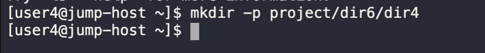
   2. Create file – /f3
   - `touch project/f3`
        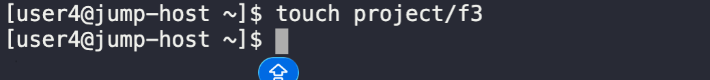

4. Login as ‘user1’ and perform below
   1. Create directory – “/home/user2/dir1”
    - `mkdir -p /home/user2/dir1`
        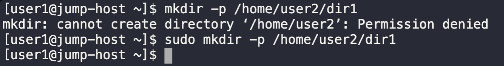

   2. Delete the directory recursively “/dir4”
   - `rm -r /dir4`
        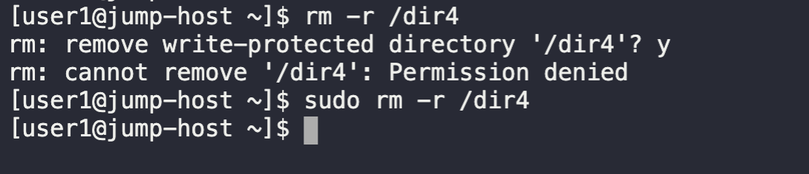

   3. Delete all child files and directories under “/opt/dir14” using single command.
   - `rm -r /opt/dir14`
        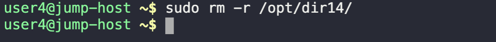

5. Login as ‘root’ user and perform below
   1. Search for the file name ‘f3’ in the server and list all absolute  paths where f3 file is found.
     - `sudo find / -type f -name "f3" 2>/dev/null`
         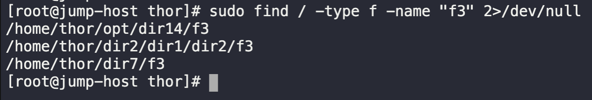
   2. Show the count of the number of files in the directory ‘/’
      - `ls -l | wc -l`
         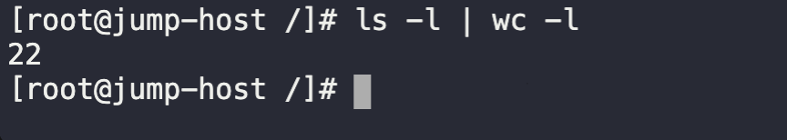

   3. Print last line of the file ‘/etc/passwd’

      - `sudo tail -n 1 /etc/passwd`
         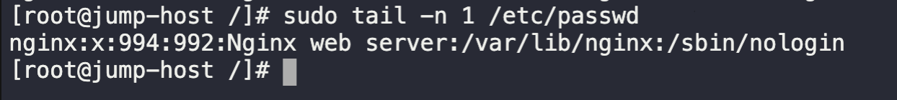

8. Login as 'thor' and perform below
   1. Delete /dir1
     -  `sudo rm -rf dir1`
     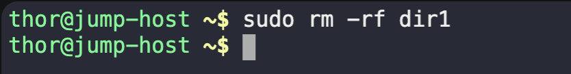

   2. Delete /dir2
    - `sudo rm -rf dir1`

   3. Delete /dir3
   - `sudo rm -rf dir1`
      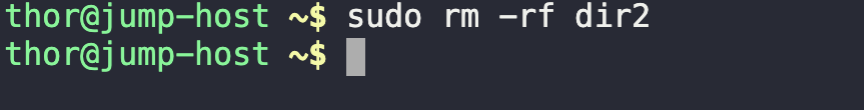

   4. Delete /dir5
   - `sudo rm -rf dir5`
     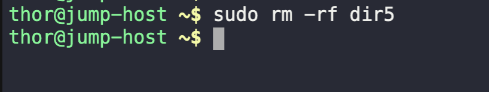

   5. Delete /dir7
   - `sudo rm -rf dir7`
      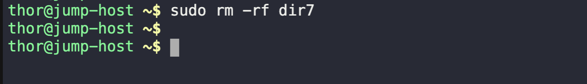

   6. Delete /f1 & /f4
   - `sudo rm -rf f1 f2`
      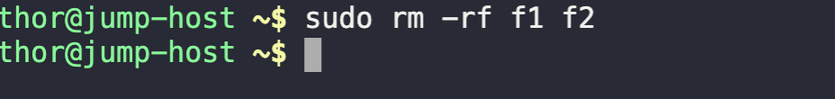

9. Logins as ‘root’ user and perform below
    1. Delete users – ‘user1, user2, user3, user4, user5’
   - `sudo userdel user1`
      

    2. Delete groups – app, aws, database, devops
   - `sudo groupdel app`
   - `sudo groupdel aws`
   - `sudo groupdel database`
   - `sudo groupdel devops`
      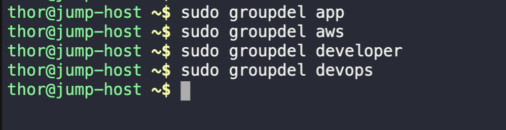

