# Deploy your code on a Docker Container using Jenkins on AWS

  

### Agenda

* Setup Jenkins
* Setup & Configure Maven and Git
* Integrating GitHub and Maven with Jenkins
* Setup Docker Host
* Integrate Docker with Jenkins
* Automate the Build and Deploy process using Jenkins
* Test the deployment

### Prerequisites

* AWS Account
* Git/ Github Account with the Source Code
* A local machine with CLI Access
* Familiarity with Docker and Git

## Step 1: Setup Jenkins Server on AWS EC2 Instance

* Setup a Linux EC2 Instance 
* Don't worry , I know that you can see the Public Ips of instance in screenshot , but before commiting the changes , I will terminate the sandbox ec2 

    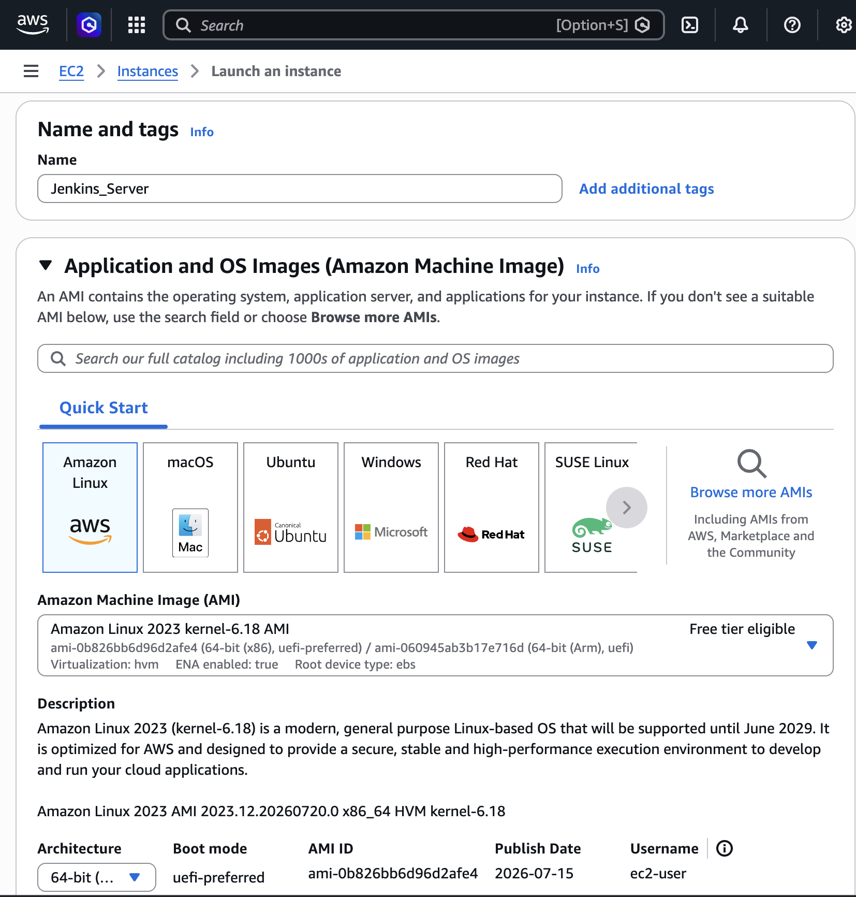

 * Checking ec2 instance status , should be running 

    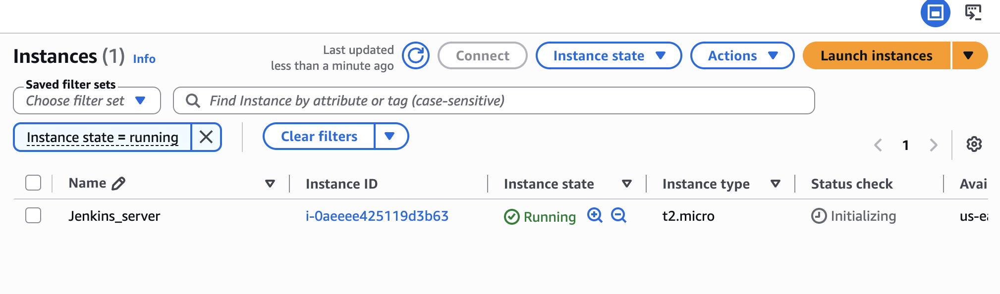

   - `ssh -i ".pem" ec2-user@IP_ADDRESS`

    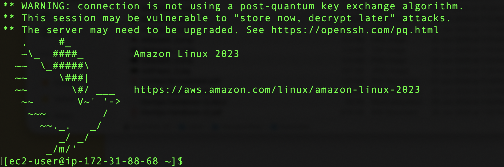

* Install Java
 - `sudo dnf update`
 - `sudo dnf install fontconfig openjdk-21`
 - `java -version`

* Another method o install in ec2 , which is easier

- `sudo dnf install java-21-amazon-corretto-devel -y`

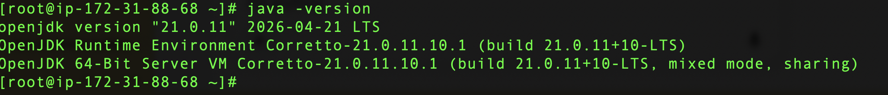

* Install Jenkins

- `sudo wget -O /etc/yum.repos.d/jenkins.repo https://pkg.jenkins.io/rpm-stable/jenkins.repo`
- `sudo yum upgrade`
* Add required dependencies for the jenkins package
- `sudo yum install fontconfig java-21-openjdk`
- `sudo yum install jenkins`
- `sudo systemctl daemon-reload`

 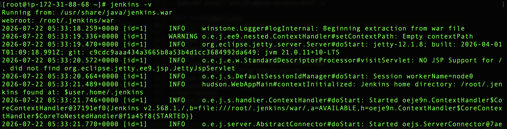

* Start Jenkins
- `sudo systemctl enable jenkins`
- `sudo systemctl start jenkins`
- `sudo systemctl status jenkins`

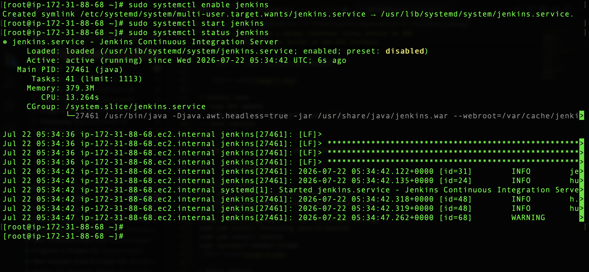

* Access Web UI on port 8080

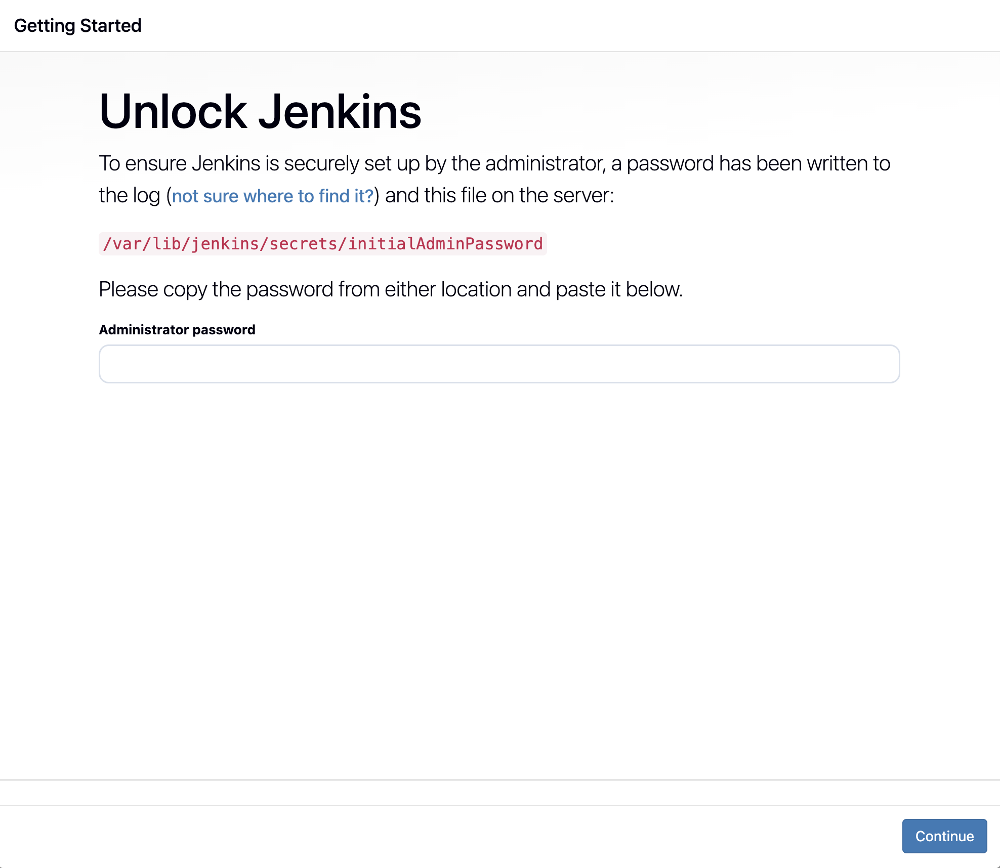

## Step 2: Integrate GitHub with Jenkins

* Install Git on Jenkins Instance

- `sudo dnf install git `
  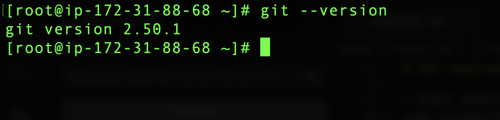
  
* Install Github Plugin on Jenkins GUI
  
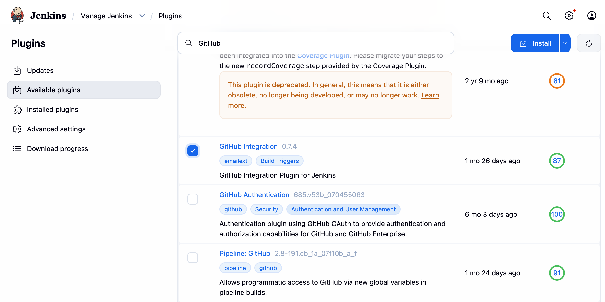

* Configure Git on Jenkins GUI

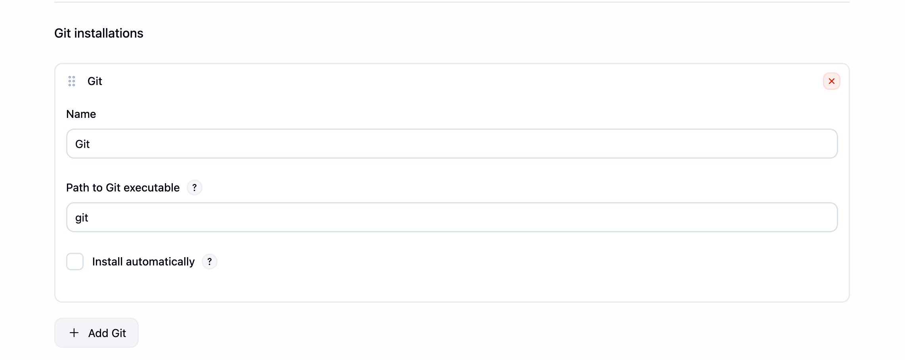

## Step 3: Integrate Maven with Jenkins

* Setup Maven on Jenkins Server

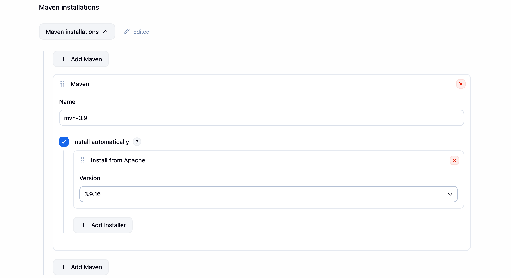

* Setup Environment Variables
JAVA_HOME,M2,M2_HOME
* Install Maven Plugin

* Configure Maven and Java

## Step 4: Setup a Docker Host

* Setup a Linux EC2 Instance
* Install Docker
* Start Docker Services
* Run Basic Docker Commands

### Create Tomcat Docker Container

**Create a Customized Dockerfile for Tomcat:**

### Step 5: Integrate Docker with Jenkins

* Create a dockeradmin user
* Install the “Publish Over SSH” plugin
* Add Dockerhost to Jenkins “configure systems”

### Step 6: Create Jenkins Job to Build and Copy Artifacts on to Docker Host

## Step 7: Update Dockerfile to copy Artifacts to launch New Container